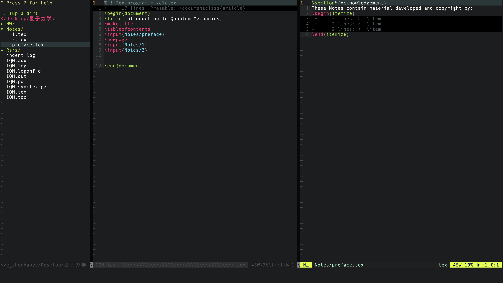

# Vim Configuration and $\LaTeX$ Templates

## Introduction



```shell
git clone https://github.com/anyeZHY/Vim-Configuration.git
```

#### Install and Plugin Via Vundle

```shell
vim ~/.vimrc
```

```shell
:PluginInstall
```

#### My Snippets

You could skim `CheatSheet of my Snippets.md` to get a glimpse of the shortcuts for $\LaTeX$.

```shell
vim ~/.vim/UltiSnips/tex.snippets
```

### Acknowledgement

- Gilles Castel's Blog: [https://castel.dev/post/lecture-notes-1/](https://castel.dev/post/lecture-notes-1/).
