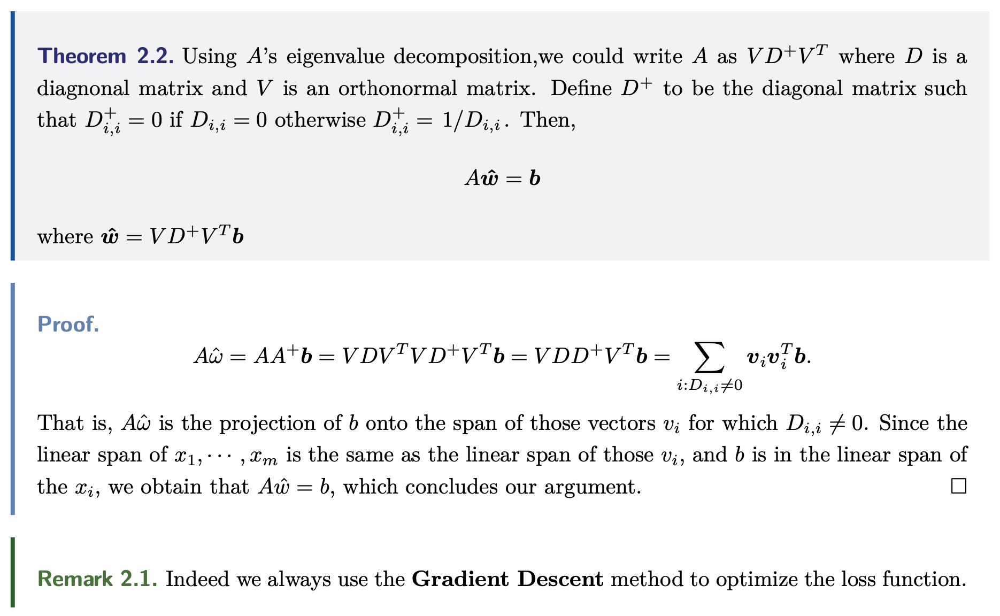
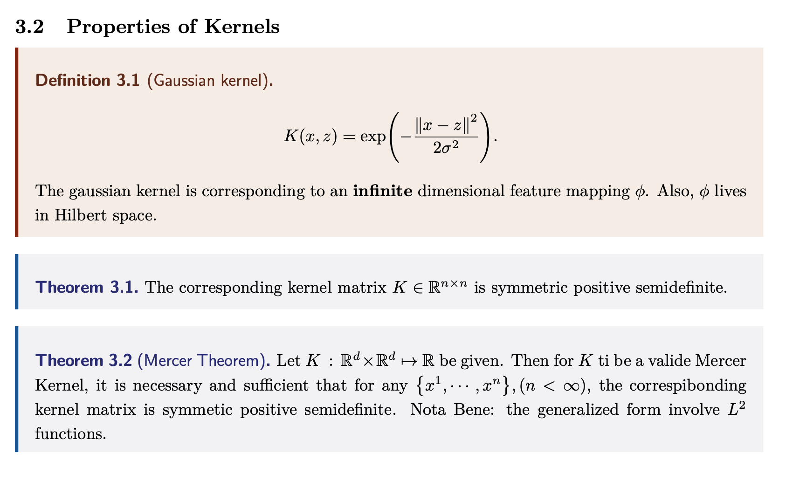

# Vim Configuration and LaTeX Templates

## Introduction

Here are some demonstrations of my Vim and PDFs generated by LaTeX.






```shell
git clone https://github.com/anyeZHY/Vim-Configuration.git
```

### Vim

#### Install and Plugin Via Vundle

```shell
vim ~/.vimrc
```

```shell
:PluginInstall
```

#### My Snippets

You could skim `CheatSheet of my Snippets.md` to get a glimpse of the shortcuts for LaTeX.

```shell
vim ~/.vim/UltiSnips/tex.snippets
```

### LaTeX

In path `LaTeX Templates/`, you could find my templates in which I define many mappings and splendid **Theorem environments**.

## Acknowledgement

- Gilles Castel's Blog: [https://castel.dev/post/lecture-notes-1/](https://castel.dev/post/lecture-notes-1/).
